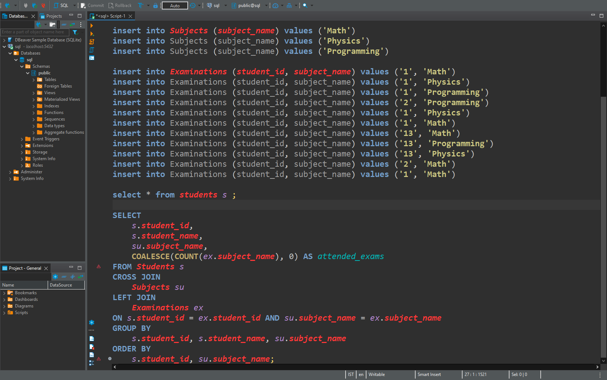
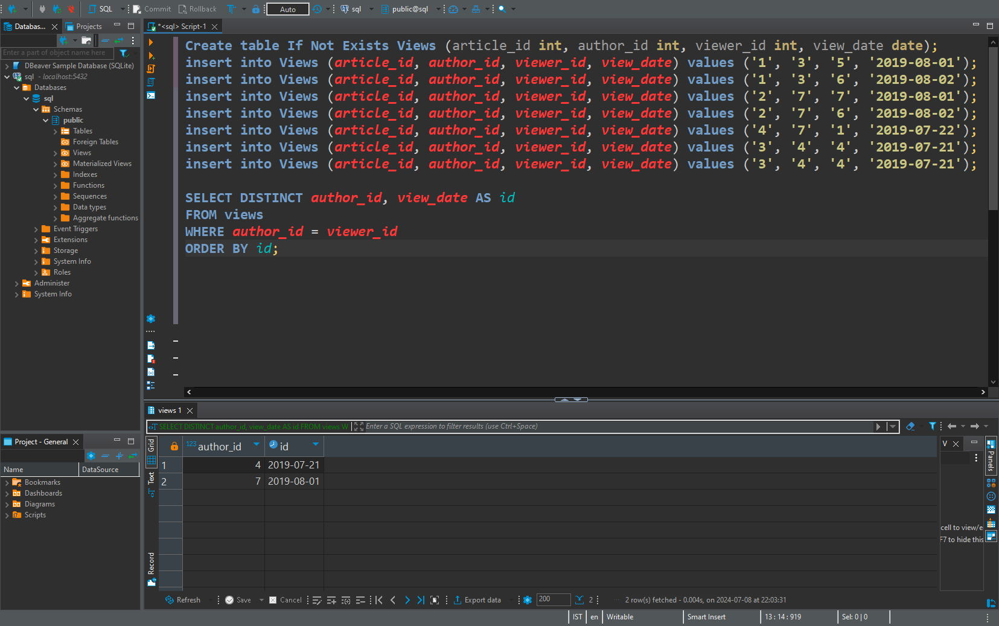
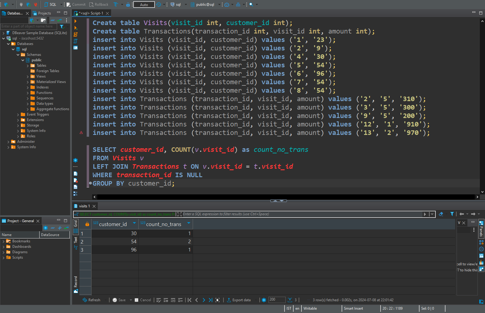

# SQL Projects

This project contains sql files related to data analysis, optimizations, manipulation. It consists of topics like SELECT, JOINS, Subqueries, Window Functions, CTEs, Aggregate Functions and more.

## Table of Contents

- Introduction
- Features
- SQL Dialect
- Installation
- Usage
- Examples
- Contributing
- Contact

## Introduction

I have created this repository to include all kinds of queries available in sql. So that it might be helpful to those studying sql from basic to advanced. And I will keep updating it frequently to add more topics.

## Features

  - Contains sql queries for various uses
    
  - Complex queries using subqueries, joins, ctes
    
  - Real-world data analysis scenarios
    
  - Query Optimization for better performance

  - Tons of queries related to aggregate functions

## SQL Dialect Used

- **PostgreSQL (psql):**  Most of the scripts in this repository is written for PostgresSQL. 

## Installation

Clone the repository to your local machine

```bash
  git clone https://github.com/dirtyyuka/sql-projects.git
```

## Usage

1. Open your SQL client (e.g., PgAdmin, MySQL WorkBench, DBeaver etc.)


2. Drop your files to the client and run your queries to perform data operations.



## Examples

1. This is a basic select query where I select the authors who have viewed there own articles at least once.



2. This is basic join where I select customers who visited the mall but did not make any transactions and the count of those non-transactions.



## Contributing

Contribution are appreciated! Please fork the repository and create a pull request with changes

1. Fork the repository.

2. Create a branch.
   
```bash
  git checkout -b feature-branch
```

3. Make the changes.

4. Commit the changes.

```bash
  git commit -m 'The change you made'
```

5. Push to the branch.

```bash
  git push origin feature-branch
```

6. Create a pull request.

## License
This project is licensed under the MIT License. See the [LICENSE](https://github.com/dirtyyuka/sql-projects/blob/main/LICENSE.txt) file for more details.

## Contact

Feel free to reach out for any questions or suggestions

- Email: fireboybusinesses@gmail.com
- GitHub: [dirtyyuka](https://github.com/dirtyyuka)


 

 


